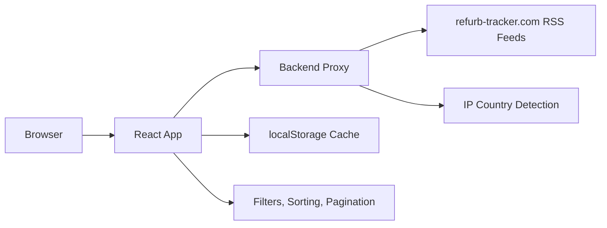

# RefurbRadar

RefurbRadar is a React and TypeScript browser for Apple refurbished products across 25 international storefronts. It reads RSS feed data through a server-side proxy, normalizes inconsistent product titles and prices into structured records, and provides fast client-side search, filtering, sorting, pagination, and cache-aware refresh controls.

## Highlights

- Multi-country product browsing with localized currency parsing
- Category, keyword, price, and date-based client-side exploration
- RSS/Atom XML parsing with product normalization for titles, prices, SKUs, specs, chips, RAM, storage, networking, and images
- Browser caching for feed XML, parsed products, selected country, and image load state
- IP-based country detection through a backend proxy endpoint
- Responsive Tailwind CSS interface with loading, error, empty, and cache status states
- TypeScript, ESLint, and production build scripts for maintainable frontend development

## Tech Stack

- React 19
- TypeScript
- Vite
- Tailwind CSS
- ESLint
- Browser Fetch API
- DOMParser
- Vercel Analytics

## Architecture



## Data Flow

1. `useCountry` checks localStorage for a saved storefront.
2. If no storefront is saved, `useCountry` calls `GET /api/ip/country` on the configured backend proxy.
3. `useFeed` builds the source feed URL for the selected country and calls `fetchFeed`.
4. `fetchFeed` calls `GET /api/feeds/:countryCode` on the backend proxy, then caches feed XML in localStorage.
5. `parseFeed` converts RSS/Atom XML into raw feed items.
6. `normalizeProducts` extracts product metadata and converts it into typed `Product` records.
7. `Home` applies category filters, search, sorting, and pagination in memory.

## Backend Contract

This repository is the frontend only. It expects a backend proxy because RSS feeds and IP lookup should not be fetched directly from the browser in production.

Set the frontend environment variable:

```bash
VITE_API_BASE_URL=http://localhost:3000
```

The backend should expose:

```txt
GET /api/feeds/:countryCode
```

```txt
GET /api/ip/country
```

Returns one of these JSON shapes:

```json
{ "countryCode": "nz" }
```

```json
{ "country_code": "NZ" }
```

```json
{ "isoCode": "NZ" }
```

If the backend or geolocation endpoint is unavailable, the app falls back to New Zealand.

## Getting Started

### Prerequisites

- Node.js 20.19+ or 22.12+
- npm
- A compatible backend proxy configured with `VITE_API_BASE_URL`

### Installation

```bash
git clone <repository-url>
cd RefurbRadar-frontend
npm install
cp .env.example .env
npm run dev
```

Open `http://localhost:5173`.

### Production Build

```bash
npm run build
npm run preview
```

## Available Scripts

- `npm run dev` starts the Vite development server
- `npm run build` runs TypeScript build checks and creates a production bundle
- `npm run preview` previews the production build locally
- `npm run lint` runs ESLint
- `npm run fetch:feeds` downloads RSS XML files into `public/data/` for experiments or offline inspection

## Repository Safety

The repository is prepared for public GitHub use:

- `.env`, `.env.local`, production env files, `node_modules`, `dist`, and generated XML feeds are ignored.
- `.env.example` documents the required public environment variable without including secrets.
- No API keys, passwords, bearer tokens, private keys, or credentials are committed.

Do not commit:

- Real `.env` files
- Private backend URLs if you do not want them public
- API keys or provider tokens
- Generated `public/data/*.xml` feed files
- Deployment secrets

## Project Structure

```txt
src/
  api/
    fetchFeed.ts
    normalizeProduct.ts
    parseFeed.ts
  components/
    CategoryFilter.tsx
    CountrySelect.tsx
    Header.tsx
    Pagination.tsx
    ProductCard.tsx
    ProductGrid.tsx
    SpecFilters.tsx
    States.tsx
  config/
    countries.ts
  hooks/
    useCountry.ts
    useFeed.ts
    useImageCache.ts
  pages/
    Home.tsx
  types/
    product.ts
  utils/
    cache.ts
    category.ts
    format.ts
    html.ts
    regex.ts
scripts/
  fetchFeeds.mjs
public/
  logo.PNG
```

## Supported Countries

RefurbRadar supports 25 storefront feed codes:

`au`, `bx`, `be`, `ca`, `xf`, `cn`, `de`, `es`, `fr`, `hk`, `hz`, `ie`, `it`, `jp`, `nl`, `nz`, `at`, `pl`, `sg`, `kr`, `cx`, `ch`, `tw`, `uk`, `us`.

## Implementation Notes

### Product Normalization

Product titles and descriptions are cleaned to remove redundant SKUs, prices, localized refurbished prefixes, strikethrough prices, and duplicate specification text. English "Refurbished" prefixes are preserved for clarity.

### Price Extraction

The app handles several regional price formats:

- `$1,299.00`, `£459.00`
- `€ 79,00`, `79,00 €`, `4 619,00 €`
- `¥295,800`, `₩4,964,000`, `HK$22,699.00`
- `CHF 1'599.00`, `1 599.00 CHF`

### Caching

The app caches:

- Feed XML for short-lived request reuse
- Parsed product lists for 30 minutes
- Selected country preference
- Image load state to reduce duplicate image work

## Troubleshooting

### `Server proxy is not configured`

Create `.env` from `.env.example` and set `VITE_API_BASE_URL` to your backend proxy.

### Products do not load

Confirm the backend proxy is running and that `GET /api/feeds/:countryCode` returns XML, not HTML or JSON.

If users in a restricted network region cannot load products, deploy the backend proxy in a region that can reach `refurb-tracker.com` and is reachable by your target users. The frontend intentionally avoids public CORS proxy services.

### Country detection always uses New Zealand

Confirm `GET /api/ip/country` is available. The app falls back to New Zealand when geolocation fails.

### Local cache looks stale

Use the refresh button in the app, or clear localStorage in the browser devtools.

## License

MIT
