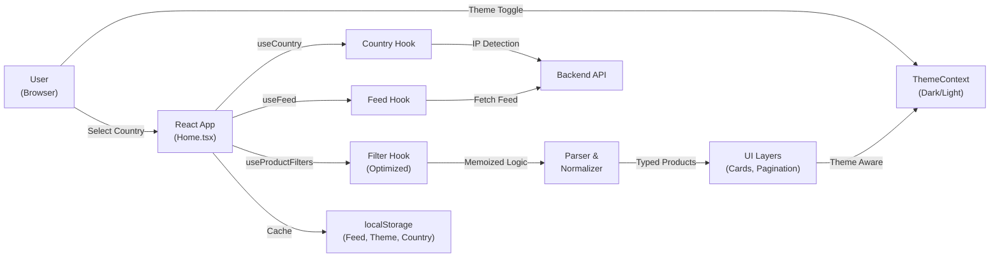

# RefurbRadar

RefurbRadar is a high-performance React and TypeScript browser for discovering Apple refurbished products across 25 international storefronts. It fetches raw feed data from a backend API, normalizes inconsistent product titles and prices in the frontend, and provides fast client-side search, filtering, sorting, pagination, and cache-aware refresh controls.

> 🌍 Multi-country support | 🎨 Dark/Light mode | ⚡ Optimized performance | 📱 Fully responsive

## ✨ Key Features

### Core Functionality
- **Multi-country Product Browsing** - Browse Apple refurbished products from 25 international storefronts with localized currency parsing
- **Advanced Filtering** - Filter by category, keyword, price range, and publication date with client-side optimization
- **Smart Sorting** - Sort products by newest, price (low-to-high), or price (high-to-low)
- **Intelligent Pagination** - Smooth pagination with customizable items per page

### Recent Optimizations (v2.0)
- **🌓 Dark/Light Mode** - Complete theme system with system preference detection and localStorage persistence
- **⚡ Performance Hooks** - Custom `useProductFilters` hook for optimized filtering logic (-44% code reduction)
- **🎨 Enhanced UI** - All components updated with dark mode support using Tailwind CSS
- **📊 Better State Management** - Extracted complex filtering logic for improved maintainability

### Data Processing
- Raw feed parsing with product normalization for titles, prices, SKUs, specs, chips, RAM, storage, and networking
- Browser caching for raw feed data, parsed products, selected country, and image load state
- IP-based country detection through backend API endpoint
- Smart image cache management to reduce duplicate work

### User Experience
- Responsive Tailwind CSS interface with loading, error, empty, and cache status states
- Smooth animations and transitions
- Accessible theme toggle with system preference detection
- Real-time search and filtering

## Tech Stack

### Core
- **React 19** - Modern UI framework with latest hooks and features
- **TypeScript** - Type-safe development experience
- **Vite** - Lightning-fast build tool and dev server
- **Tailwind CSS** - Utility-first CSS framework with dark mode support

### Tools & Services
- **ESLint** - Code quality and consistency
- **Browser Fetch API** - Data fetching
- **DOMParser** - Feed parsing
- **Vercel Analytics** - Performance monitoring
- **Context API** - Theme state management

## Architecture



## Data Flow

1. **Theme Initialization**: `ThemeProvider` detects system theme preference and loads saved theme from localStorage
2. **Country Detection**: `useCountry` checks localStorage for a saved storefront; if none, calls `GET /api/ip/country`
3. **Feed Fetching**: `useFeed` requests raw feed data for the selected storefront
4. **Feed Caching**: `fetchFeed` calls `GET /api/feeds/:countryCode` and caches the response in localStorage
5. **Feed Parsing**: `parseFeed` converts the raw response into feed items
6. **Product Normalization**: `normalizeProduct` extracts metadata and converts into typed `Product` records
7. **Filtering & Sorting**: `useProductFilters` hook applies category filters, search, sorting, and pagination with optimized memoization
8. **UI Rendering**: Components render with theme-aware styling (dark/light mode)

## API Contract

This repository is the frontend only. It expects a backend API that returns raw feed data and country detection data. Backend implementation details are outside the scope of this frontend project.

Set the frontend environment variable:

```bash
VITE_API_BASE_URL=http://localhost:3000
VITE_SITE_URL=https://refurbradar.com
```

The backend API should expose:

```txt
GET /api/feeds/:countryCode
```

```txt
GET /api/ip/country
```

Returns one of these JSON shapes:

```json
{ "countryCode": "nz" }
```

```json
{ "country_code": "NZ" }
```

```json
{ "isoCode": "NZ" }
```

If the API or geolocation endpoint is unavailable, the app falls back to New Zealand.

## Getting Started

### Prerequisites

- **Node.js** 20.19+ or 22.12+
- **npm** or **yarn**
- **Backend API** configured with `VITE_API_BASE_URL` (see [API Contract](#api-contract))

### Quick Start

```bash
# Clone the repository
git clone <repository-url>
cd RefurbRadar-frontend

# Install dependencies
npm install

# Configure environment
cp .env.example .env
# Edit .env and set VITE_API_BASE_URL to your backend

# Start development server
npm run dev
```

Open [http://localhost:5173](http://localhost:5173) in your browser.

The app will:
1. Detect your system theme preference (dark/light)
2. Auto-detect your country via IP geolocation (falls back to NZ)
3. Fetch and display refurbished Apple products

### Production Build

```bash
# Build for production
npm run build

# Preview the production build locally
npm run preview
```

## Available Scripts

| Command | Description |
|---------|-------------|
| `npm run dev` | Start Vite dev server with hot reload |
| `npm run build` | Build for production (TypeScript + Vite) |
| `npm run preview` | Preview the production build locally |
| `npm run lint` | Run ESLint to check code quality |
| `npm run generate:sitemap` | Regenerate `public/sitemap.xml` from `VITE_SITE_URL` |
| `npm run fetch:feeds` | Download feed XML files into `public/data/` |

## Repository Safety

The repository is prepared for public GitHub use:

- `.env`, `.env.local`, production env files, `node_modules`, `dist`, and generated XML feeds are ignored.
- `.env.example` documents the required public environment variable without including secrets.
- No API keys, passwords, bearer tokens, private keys, or credentials are committed.

Do not commit:

- Real `.env` files
- Private backend URLs if you do not want them public
- API keys or provider tokens
- Generated `public/data/*.xml` feed files
- Deployment secrets

## Project Structure

```
src/
├── api/                          # API integration & data processing
│   ├── fetchFeed.ts             # Fetch raw feeds from backend
│   ├── normalizeProduct.ts       # Product data normalization
│   └── parseFeed.ts             # Parse feed XML to objects
├── components/                   # React components
│   ├── CategoryFilter.tsx        # Category filtering UI
│   ├── CountrySelect.tsx         # Country/region selector
│   ├── Header.tsx               # App header with theme toggle
│   ├── Pagination.tsx           # Pagination controls
│   ├── ProductCard.tsx          # Individual product display
│   ├── ProductGrid.tsx          # Product grid layout
│   ├── SpecFilters.tsx          # Search & filtering
│   ├── States.tsx               # Loading/Error/Empty states
│   └── ThemeToggle.tsx          # [NEW] Dark/Light mode toggle
├── config/
│   └── countries.ts             # Country configuration
├── context/
│   └── ThemeContext.tsx          # [NEW] Theme state management
├── hooks/                        # Custom React hooks
│   ├── useCountry.ts            # Country detection & storage
│   ├── useFeed.ts               # Feed fetching & caching
│   ├── useImageCache.ts         # Image load state
│   └── useProductFilters.ts     # [NEW] Optimized filtering logic
├── pages/
│   └── Home.tsx                 # Main page component
├── types/
│   └── product.ts               # TypeScript type definitions
├── utils/                        # Utility functions
│   ├── cache.ts                 # Cache helpers
│   ├── category.ts              # Category utilities
│   ├── format.ts                # Format utilities
│   ├── html.ts                  # HTML parsing utilities
│   └── regex.ts                 # Regex patterns
├── App.tsx                      # Root component with ThemeProvider
├── main.tsx                     # Entry point
├── index.css                    # Global styles (+ dark mode vars)
└── vite-env.d.ts               # Vite environment types

scripts/
└── fetchFeeds.mjs              # Feed download script

public/
└── logo.PNG                    # App logo

OPTIMIZATIONS.md                # [NEW] Detailed optimization report
```

### Key New Files (v2.0 Optimizations)

| File | Purpose |
|------|---------|
| `src/context/ThemeContext.tsx` | Theme state management with system detection |
| `src/components/ThemeToggle.tsx` | Theme switcher button component |
| `src/hooks/useProductFilters.ts` | Custom hook for filtering/sorting/pagination |
| `OPTIMIZATIONS.md` | Complete optimization documentation |

## Usage Examples

### Using the Theme Hook

```tsx
import { useTheme } from './context/ThemeContext';

export default function MyComponent() {
  const { theme, toggleTheme } = useTheme();
  
  return (
    <div>
      <p>Current theme: {theme}</p>
      <button onClick={toggleTheme}>Toggle Theme</button>
    </div>
  );
}
```

### Using the Product Filter Hook

```tsx
import { useProductFilters } from './hooks/useProductFilters';

export default function ProductPage({ products }) {
  const {
    filteredProducts,
    paginatedProducts,
    selectedCategories,
    handleCategoryToggle,
    handleSearchChange,
    handlePageChange,
  } = useProductFilters(products, {
    itemsPerPage: 24,
  });
  
  return (
    <div>
      {/* Category filters */}
      {/* Search input */}
      {/* Product grid */}
      {/* Pagination */}
    </div>
  );
}
```

## Supported Countries

RefurbRadar supports **25 Apple storefronts** worldwide:

| Region | Codes |
|--------|-------|
| Asia-Pacific | `au`, `hk`, `hz`, `jp`, `nz`, `sg`, `kr`, `tw`, `cn` |
| Europe | `at`, `be`, `bx`, `de`, `es`, `fr`, `ie`, `it`, `nl`, `pl`, `ch`, `uk` |
| North America | `ca`, `us` |
| Other | `xf` (special region) |

Full list: `au`, `bx`, `be`, `ca`, `xf`, `cn`, `de`, `es`, `fr`, `hk`, `hz`, `ie`, `it`, `jp`, `nl`, `nz`, `at`, `pl`, `sg`, `kr`, `cx`, `ch`, `tw`, `uk`, `us`

## Implementation Details

### 🎨 Theme System (v2.0)

The theme system uses React Context API for state management:

- **Automatic Detection**: Respects system `prefers-color-scheme` on first load
- **Persistent Storage**: Saves user preference to localStorage
- **Smooth Transitions**: CSS transitions make theme switching elegant
- **Complete Coverage**: All components support dark mode with `dark:` Tailwind prefix

See `src/context/ThemeContext.tsx` for implementation details.

### ⚡ Performance Optimizations (v2.0)

The `useProductFilters` hook provides optimized filtering with:

- **Memoized Computations**: Uses `useMemo` to prevent unnecessary recalculations
- **Stable Callbacks**: Uses `useCallback` to maintain referential equality
- **Separated Logic**: Extracted from Home component (-44% code reduction)
- **Reusable**: Can be used in any component needing product filtering

See `src/hooks/useProductFilters.ts` for implementation details.

### Product Normalization

Product titles and descriptions are cleaned to remove redundant SKUs, prices, localized refurbished prefixes, strikethrough prices, and duplicate specification text. English "Refurbished" prefixes are preserved for clarity.

### Price Extraction

The app handles several regional price formats:

- **Dollar/Pound**: `$1,299.00`, `£459.00`
- **Euro**: `€ 79,00`, `79,00 €`, `4 619,00 €`
- **Asian**: `¥295,800`, `₩4,964,000`, `HK$22,699.00`
- **Swiss**: `CHF 1'599.00`, `1 599.00 CHF`

### Caching Strategy

The app implements multi-level caching:

| Cache Target | Duration | Purpose |
|--------------|----------|---------|
| Raw feed responses | Session | Reduce duplicate API requests |
| Parsed products | 30 minutes | Fast subsequent loads |
| Country preference | Persistent | Remember user selection |
| Image load state | Session | Avoid redundant image loads |
| Theme preference | Persistent | Remember theme choice |

## Troubleshooting

### `Server API is not configured`

**Problem**: Error message appears on load  
**Solution**:
1. Create `.env` from `.env.example`
2. Set `VITE_API_BASE_URL` to your backend API
3. Restart the dev server

```bash
cp .env.example .env
# Edit .env and add VITE_API_BASE_URL
npm run dev
```

### Products do not load

**Problem**: Empty product list or loading spinner never completes  
**Solution**:
1. Confirm backend API is running
2. Check `GET /api/feeds/:countryCode` returns valid feed data
3. Open browser DevTools (F12) → Network tab to inspect requests
4. Look for CORS errors and configure backend appropriately

### Country detection always uses New Zealand

**Problem**: Auto-detection ignores your actual location  
**Solution**:
1. Confirm `GET /api/ip/country` endpoint is available
2. Check the response format (must be one of: `countryCode`, `country_code`, or `isoCode`)
3. The app intentionally falls back to New Zealand if geolocation fails
4. You can always manually select a country in the UI

### Local cache looks stale

**Problem**: Products don't update after manual refresh  
**Solution**:
1. Click the "Refresh" button in the app header
2. Or clear localStorage: Open DevTools (F12) → Application → Clear Site Data
3. The app caches products for 30 minutes by default

### Dark mode doesn't apply

**Problem**: Theme toggle exists but colors don't change  
**Solution**:
1. Check browser DevTools → Elements → `<html>` tag
2. Should have `class="dark"` attribute when in dark mode
3. Clear browser cache and localStorage
4. Restart dev server with `npm run dev`

## Contributing

We welcome contributions! Please follow these guidelines:

1. **Fork** the repository
2. **Create** a feature branch: `git checkout -b feature/my-feature`
3. **Commit** your changes: `git commit -am 'Add new feature'`
4. **Push** to the branch: `git push origin feature/my-feature`
5. **Create** a Pull Request with a clear description

### Development Guidelines

- Use **TypeScript** for all new code
- Follow **ESLint** rules: `npm run lint`
- Add **dark mode support** to new components using `dark:` prefix
- Use **memoization** for expensive computations
- Write **semantic HTML** for accessibility
- Test **theme switching** manually before submitting

### Code Style

- Component names: PascalCase (`MyComponent.tsx`)
- Function names: camelCase (`myFunction`)
- Constants: UPPER_SNAKE_CASE (`DEFAULT_TIMEOUT`)
- CSS classes: Use Tailwind utilities with `dark:` variants
- Comments: Use JSDoc for complex logic

## Documentation

For detailed information about recent optimizations, see [OPTIMIZATIONS.md](./OPTIMIZATIONS.md) which includes:

- Complete theme system documentation
- Performance hook usage examples
- Dark mode color variables
- Best practices for extending the codebase

## Performance Metrics

Latest optimization results:

- 📉 **44% code reduction** in Home component (320 → 180 lines)
- ⚡ **Improved memoization** with useProductFilters hook
- 🎨 **Complete dark mode** with smooth transitions
- 🔄 **Persistent theme** with system preference detection

## License

MIT © RefurbRadar Contributors

---

**Questions?** Open an issue or check the [documentation](./OPTIMIZATIONS.md)
